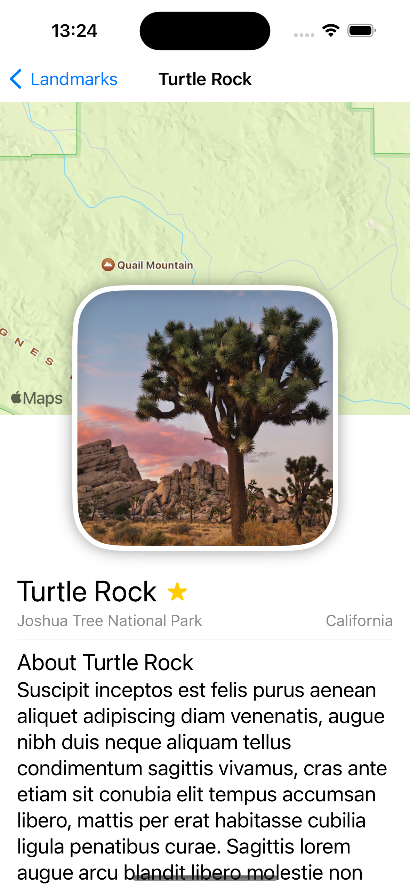

# swift-training

Multiple swift &amp; swiftUI applications for training in the language and functionalities for the final project. Done in 2024 as part of graduate studies at ENSICAEN, France.

## First Project : **Teki**

A "Game" where a *button* shuffles a text, which is a random combination of sentences.

## Second Project : Apple tutorial Chapter 1 (SwiftUI Essentials)

## CC

During training at @mobile-process (57000 Metz, France)

@tangui-steimetz
